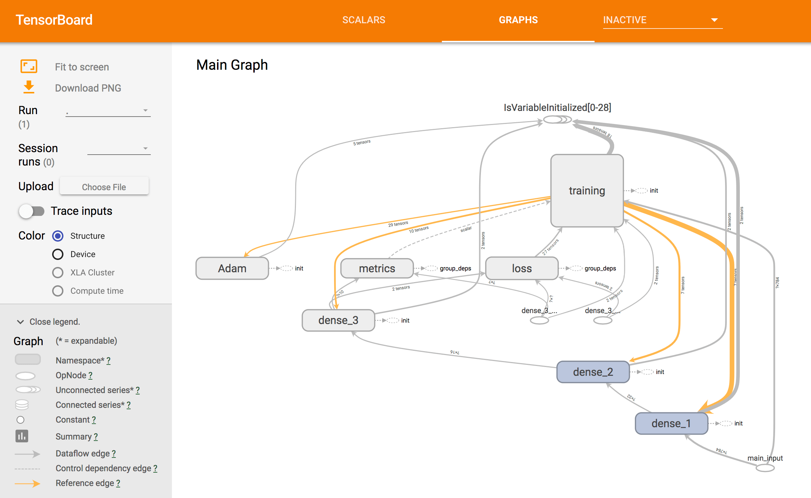

# 🎊 DeepLearning-Project-Template 🎊

@(更新时间:2020-02-20) [文档语言 : [简体中文](./README_Simplified_Chinese.md) & [英语](./README.md) | 编程语言 : Python | Website : [AIParkHub](https://github.com/aiparkhub) | GeekDeveloper : [JEEP-711](https://github.com/jeep711) | Github : [github.com/aiparkhub](https://github.com/aiparkhub) |  |  ]

> [AiParkHub - 深度学习工程模板](https://github.com/aiparkhub/DeepLearning-Project-Template)是基于PEP8(Python Enhancement Proposal #8)之上构建的工程模板, 实现抽象封装公共资源/简化加载数据/构建网络/训练模型/预测样本的工作流程.
>
> [工程地址 : https://github.com/aiparkhub/DeepLearning-Project-Template](https://github.com/aiparkhub/DeepLearning-Project-Template)


## 1. 如何使用
### 1.1 克隆工程
``` bash
git clone https://github.com/aiparkhub/DeepLearning-Project-Template.git
```

### 1.2 创建和激活虚拟环境
``` bash
virtualenv venv
source venv/bin/activate
```

### 1.3 安装Python依赖库
> 1.3.0 ⚠️ 预先检查Python版本 - Python版本应>=3.x.x
``` bash
(base) systemhub:~ system$ python --version
Python 3.7.5
(base) systemhub:~ system$ 
```
> 
> 1.3.1 ⚠️ 预先检查pip版本
``` bash
(base) systemhub:~ system$ pip --version
pip 20.0.2 from /XXX/XXX/Python.framework/Versions/3.7/lib/python3.7/site-packages/pip (python 3.7)
(base) systemhub:~ system$ pip3 --version
pip 20.0.2 from /XXX/XXX/Python.framework/Versions/3.7/lib/python3.7/site-packages/pip (python 3.7)
(base) systemhub:~ system$ 
```
> 
> 1.3.2 ⚠️ 如pip版本过低. 应升级更新pip版本 (非低版本跳过此步骤)
>
> 如pip默认为海外镜像源, 网络连接较差,可临时使国内镜像站升级pip, 升级后再将pip默认设置为国内镜像源.
```
pip install -i https://pypi.tuna.tsinghua.edu.cn/simple pip -U
```
> 
> 将pip默认设置为国内镜像源
```
pip config set global.index-url https://pypi.tuna.tsinghua.edu.cn/simple
```

>1.3.3 ⚠️ 安装h5py时候可能会出问题, 因为h5py需要编译, 出现的问题一般是gcc或者g++版本的问题, 所以在pip install 之前, 可以通过在命令行键入来临时修改当前终端的环境变量gcc和g++对应位置
```
export CC=/usr/local/bin/gcc
export CXX=/usr/local/bin/g++
```
>
> 1.3.4 (中央处理器) CPU版本 | 如有多本版pip, 请使用pip3进行操作
``` bash
pip3 install -r requirements-cpu.txt
```
> 
> 1.3.5 (图形处理器) GPU版本 | 如有多本版pip, 请使用pip3进行操作
``` bash
pip3 install -r requirements-gpu.txt
```

### 1.4 自定义 开发流程
> - 1.自定义数据加载类需要继承```DataLoaderBase```;
> - 2.自定义网络结构类需要继承```ModelBase```;
> - 3.自定义模型训练类需要继承```TrainerBase```;
> - 4.自定义样本预测类需要继承```InferBase```;
> - 5.自定义配置文件写入实验的相关参数;
> - 6.执行训练模型和预测样本操作;


## 2. 工程示例
### 2.1 识别 手写数字
> 识别[MNIST](http://yann.lecun.com/exdb/mnist/)库中手写数字, 工程``simple_mnist``

#### 2.1.1 训练
``` bash
python main_train.py -c config/simple_mnist_config.json
```

#### 2.1.2 预测
``` bash
python main_test.py -c config/simple_mnist_config.json -m simple_mnist.weights.10-0.24.hdf5
```

#### 2.1.3 网络结构

 
#### 2.1.4 TensorBoard



## 3. 工程架构


### 3.1 工程树形结构


## 4. 工程主要组件
### 4.1 DataLoader
### 4.2 Model
### 4.3 Trainer
### 4.3 Infer
### 4.5 Config
### 4.6 Main

## 感谢
> 参考[Tensorflow-Project-Template](https://github.com/MrGemy95/Tensorflow-Project-Template)
